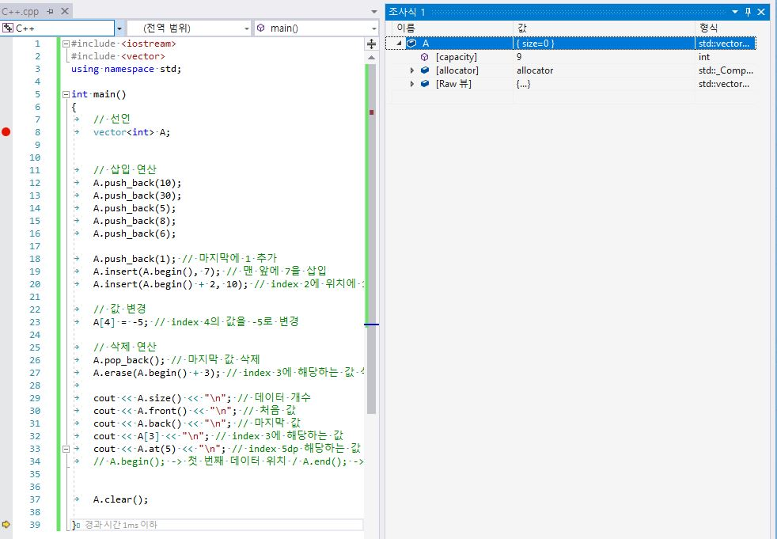

# 배열과 리스트 그리고 벡터

## 배열과 리스트의 핵심 이론

### 배열
- 배열은 메모리의 연속 공간에 값이 채워져 있는 형태의 자료 구조
- 배열의 값은 인덱스를 통해 참조 가능
- 선언한 자료형의 값만 저장 가능

### 배열의 특징
1. 인덱스를 사용하여 값에 바로 접근할 수 있다
2. 새로운 값을 삽입하거나 특정 인덱스에 있는 값을 삭제하기 어렵다. 값을 삽입하거나 삭제하려면 해당 인덱스 주변에 있는 값을 이동시키는 과정이 필요하다
3. 배열의 크기는 선언할 때 지정할 수 있으며, 한 번 선언하면 크기를 늘리거나 줄일 수 없다
4. 구조가 간단하므로 코딩테스트에서 많이 사용한다.

### 리스트
- 리스트는 값과 포인터를 묶은 노드라는 것을 포인터로 연결한 자료구조
- (노드는 컴퓨터 과학에서 값, 포인터를 쌍으로 갖는 기초 단위)

### 리스트의 특징
1. 인덱스가 없었으므로 값에 접근하려면 Head 포인터부터 순서대로 접근해야 한다. 접근 속도가 느리다
2. 포인터로 연결되어 있으므로 데이터를 삽입하거나 삭제하는 연산 속도가 빠르다
3. 선언할 때 크기를 별도로 지정하지 않아도 된다. 다시 말해 리스트의 크기는 정해져 있지 않으며, 크기가 변하기 쉬운 데이터를 다룰 때 적절하다
4. 포인터를 저장할 공간이 필요하므로 배열보다 구조가 복잡하다

### 벡터
- vector는 C++ 표준라이브러리에 있는 자료구조 컨테이너 중 하나로, 사용자가 손쉽게 사용하기 위해 정의된 클래스
- 기존의 배열과 같은 특징을 가지면서 배열의 단점을 보완한 '동적 배열의 형태'

### 벡터의 특징
1. 동적으로 원소를 추가할 수 있다. 즉, 크기가 자동으로 늘어난다
2. 맨 마지막 위치에 데이터를 삽입하거나 삭제할 때는 문제가 없지만 중간 데이터의 삽입 삭제의 배열과 같은 메커니즘으로 동작한다
3. 배열과 마찬가지로 인덱스를 이용하여 각 데이터에 직접 접근할 수 있다.

- 가장 큰 특징은 개발자가 사용하기 편리하고 쉬우므로 코딩테스트에서 굉장히 많이 사용한다

```c++
#include <iostream>
#include <vector>
using namespace std;

int main()
{
	// 선언
	vector<int> A;


	// 삽입 연산
	A.push_back(10);
	A.push_back(30);
	A.push_back(5);
	A.push_back(8);
	A.push_back(6);

	A.push_back(1); // 마지막에 1 추가
	A.insert(A.begin(), 7); // 맨 앞에 7을 삽입
	A.insert(A.begin() + 2, 10); // index 2에 위치에 10 삽입

	// 값 변경
	A[4] = -5; // index 4의 값을 -5로 변경

	// 삭제 연산
	A.pop_back(); // 마지막 값 삭제
	A.erase(A.begin() + 3); // index 3에 해당하는 값 삭제
	
	cout << A.size() << "\n"; // 데이터 개수
	cout << A.front() << "\n"; // 처음 값
	cout << A.back() << "\n"; // 마지막 값
	cout << A[3] << "\n"; // index 3에 해당하는 값
	cout << A.at(5) << "\n"; // index 5dp 해당하는 값
	// A.begin(); -> 첫 번째 데이터 위치 / A.end(); -> 마지막 데이터 다음 위치


	A.clear();

}
```


