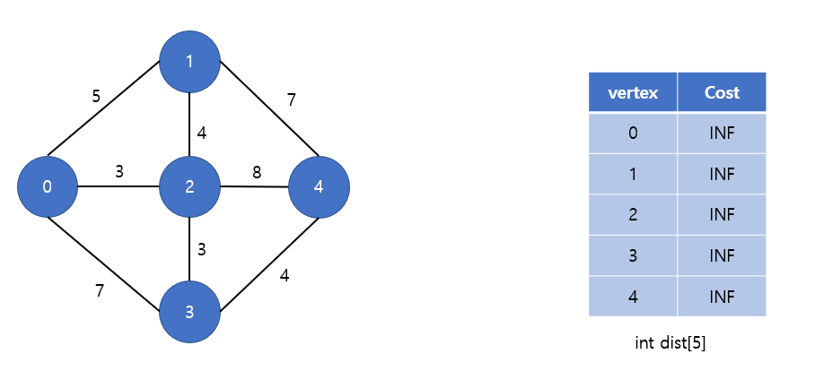
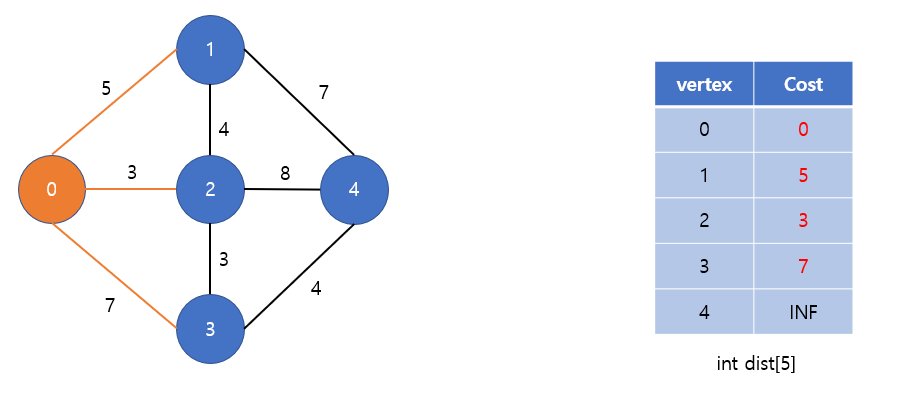
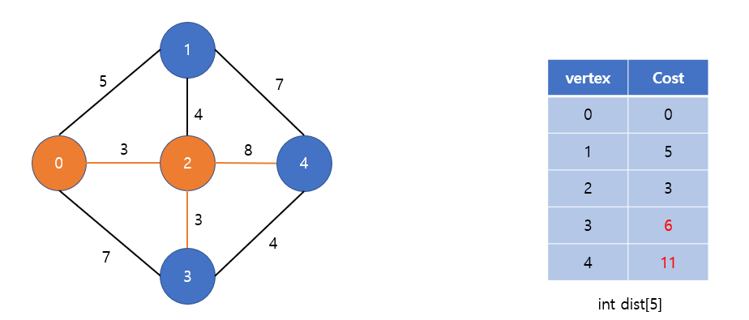
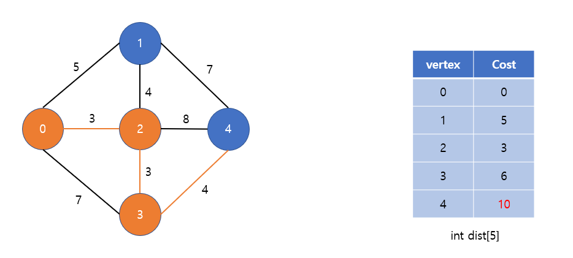
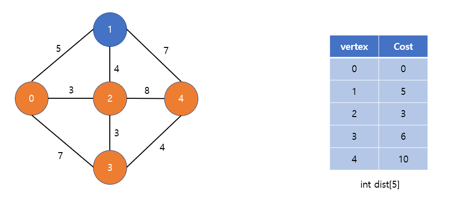
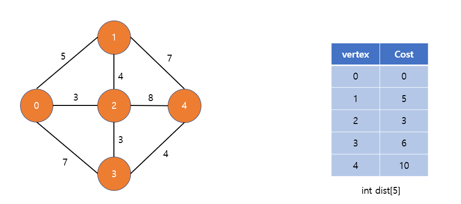

# Dijsktra algorithm

\

- 출처 : [위키 백과](https://ko.wikipedia.org/wiki/%EB%8D%B0%EC%9D%B4%ED%81%AC%EC%8A%A4%ED%8A%B8%EB%9D%BC_%EC%95%8C%EA%B3%A0%EB%A6%AC%EC%A6%98)

- 다익스트라 알고리즘은 그래프 상에서 시작 정점부터 나머지 각 정점 까지의 최단거리를 계산하는 알고리즘이다
- 다익스트라 알고리즘은 그래프의 어느 간선의 가중치라도 음수가 있어선 안된다.

```
1. 방문하지 않은 정점 중 가장 가중치 값이 작은 정점을 방문한다. (처음엔 시작 정점 방문)
2. 해당 정점을 거쳐서 갈수 있는 정점의 거리가 이전에 기록한 값 보다 작다면 그 거리를 갱신한다.
```

## 예시 1)
### 출처 : https://code-lab1.tistory.com/29



- 시작정점은 0번 정점이라고 가정
- 나머지 정점까지 최단 거리 계산
- 1차원 배열 dist에 각 정점까지의 최단거리를 갱신해 나갈 예정
- dist의 모든 값은 INF(무한대)로 설정



- 가장 먼저 시작정점을 방문
- 시작 정점에서 방문 할 수 있는 정점들에 대한 거리를 갱신한다



- 방문하지 않은 정점 중 가장 가중치가 작은 2번 정점을 방문
- 0번 정점에서 2번 정점을 거쳐서 4번 정점을 가면 기존 거리 보다 최단 거리이므로 갱신 (INF > 11)
- 0번 정점에서 2번 정점을 거쳐서 3번 정점을 가면 기존 거리보다 최단 거리이므로 갱신 (7 > 6)



- 방문하지 않은 정점 중 가장 가중치가 작은 3번 정점을 방문
- 0번 정점 - 2번 정점 - 3번 정점을 거쳐서 4번 정점을 가면 기존 거리 보다 최단 거리이므로 갱신 (11 > 10)



- 방문하지 않은 정점 중 가장 가중치가 작은 4번 정점 방문
- 갱신할 거리가 없다



- 방문하지 않은 정점 중 가장 가중치가 작은 1번 정점 방문
- 갱신할 거리가 없다
- 모든 정점을 방문했으므로 종료

## 예시 2)

```
파이썬 형식

      B
   3/ 1| \7
  A    E   C
  \9      /1
      D

index A : 0 / B : 1 / C : 2 / D : 3 / E : 4

5 7 (정점 / 간선)
0 1 3 (출발점, 도착점, 비용)
0 4 5
0 3 9
1 4 1
1 2 7
2 3 1
4 2 1
시작점, 도착점 입력 받음

0 A - [1, 3] - [4, 5] - [3, 9]
1 B - [4, 1] - [2, 7]
2 C - [3, 1]
3 D
4 E - [2, 1]

reuslt 배열 만들기
시작점에서의 다른 모든 정점까지의 최소 비용을 갱신해주는 배열

heap 배열 만들기
우선순위 q 활용

0. result inf로 하드코딩
result = [inf, inf, inf, inf, inf]

1. 시작점을 경유지로, 경유지 A
2. heap에 경유지를 등록 (경유지 선택용)
heap (0, 0) [(시작점에서 경유지까지 가는데 드는 비용, 경유지 index)]
3. 시작점 -> 도착점 vs 시작점 -> 경유지 -> 도착점

result = [0, inf, inf, inf, inf]

경유지 A에서 갈 수 있는 정보는 인접 리스트에 다 들어 있음
A -> B inf
A -> A -> B 3
result = [0, 3, inf, inf, inf]
동시에 heap push
heap = [(3, 1)]

A -> E inf
A -> A -> E 5
result = [0, 3, inf, inf, 5]
heap = [(3, 1), (5, 4)]

A -> D inf
A -> A -> D 9
result = [0, 3, inf, 9, 5]
heap = [(3, 1), (5, 4), (4, 3)]

그 다음 경유지 선택 가장 적은 비용을 heappop을 통해서 logN의 속도로 빼올 수 있다

경유지 B
A -> E 5
A -> B -> E  4
result = [0, 3, inf, 9, 4]
heap = [(5, 4), (4, 3), (4, 4)]

A -> C inf
A -> B -> C 10
result = [0, 3, 10, 9, 4]
heap = [(5, 4), (4, 3), (4, 4), (10, 2)]

경유지 E
A -> C  10
A -> E -> C 5
result = [0, 3, 5, 9, 4]
heap = [(5, 4), (4, 3), (10, 2), (5, 2)]

# 튜플 또는 리스트에서 우선순위를 정할 때 0번인덱스 기준으로 우선순위를 잡고 그 다음은 1번인덱스를 기준

경유지 C
A -> D 9
A -> C -> D 6
result = [0, 3, 5, 6, 4]
heap = [(5, 4), (4, 3), (10, 2), (6, 3)]

경유지 E
이미 갱신이 되어 있으므로 continue

경유지 D
갈 수 있는 곳이 없으므로 continue

heap이 다 비어질 때까지 heappop()
```

## C++ 다익스트라 구현
- 정점 개수 v, 간선의 개수 e
- 우선순위 큐 이용 (O(NlogN))
  
```c++
#include <iostream>
#include <vector>
#include <queue>

using namespace std;

#define Max 100 // 최대 정점 개수
#define INF 987654321

vector<int> dijkstra(int start, int v, vector<pair<int, int>> adj[])
{
	vector<int> dist(v, INF); // 전부 INF로 초기화
	priority_queue<pair<int, int>> pq;

	dist[start] = 0;
	pq.push({ 0, start });	// 시작 정점 방문

	while (!pq.empty())
	{
		int cost = -pq.top().first;  // 방문한 정점의 dist 값
		int cur = pq.top().second;  // 현재 방문한 정점
		pq.pop();

		for (int i = 0; i < adj[cur].size(); i++)   // 현재 방문한 정점의 주변
		{
			int next = adj[cur][i].first;   // 조사할 다음 정점
			int nCost = cost + adj[cur][i].second;   // 현재 방문한 정점을 거쳐서
			if(nCost < dist[next])   // 기존 비용보다 현재 방문한 정점을 거친
			{
				dist[next] = nCost;   // 갱신
				pq.push({ -nCost, next });   // pq에 저장
			}
		}
	}

	return dist;
}

int main()
{
	int v, e;
	vector<pair<int, int>> adj[Max];

	cout << "정점의 개수 입력 : ";
	cin >> v;
	cout << "간선의 개수 입력 : ";
	cin >> e;

	for (int i = 0; i < e; i++)
	{
		int from, to, cost;
		cout << "그래프 입력 [정점 정점 가중치] : ";
		cin >> from >> to >> cost;
		adj[from].push_back({ to, cost });	// 양방향 그래프
		adj[to].push_back({ from, cost });
	}

	printf("\n===다익스트라 결과===\n");
	vector<int> dist = dijkstra(0, v, adj);
	for (int i = 0; i < v; i++) 
	{
		printf("0번 정점에서 %d번 정점까지 최단거리 : %d\n", i, dist[i]);
	}

	return 0;
}
```