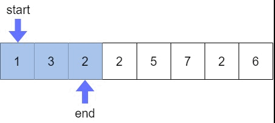

# 투포인터

## Sliding Window
- 연속되는 구간의 합
- O(n)의 속도로 해결할 수 있음



### 예시
- n개의 정수에서 m 사이즈의 연속되는 구간의 합 중 가장 큰 값 출력하기

```c++
#include <iostream>
#include <vector>
#include <numeric>

using namespace std;

vector<int> v;

int main()
{
	int n, m;

	cin >> n >> m;

	for (int i = 0; i < n; i++)
	{
		int a;
		cin >> a;
		v.push_back(a);
	}

	int sum = accumulate(v.begin(), v.end(), 0);
	int max = sum;

	for (int i = 0; i < (n - m); i++)
	{
		sum += v[i + m];
		sum -= v[i];
		if (sum > max) max = sum;
	}

	cout << max << "\n";

	return 0;
}
```

## two pointer
- 구간 합을 구할 때 사용
- 구간의 size가 정해지지 않은 구간의 합을 구할 때 two pointer 사용

```
예시) n : 10 - 정수의 개수
m : 5 - 타겟 (구간의 합이 5가 되는 경우 찾기)
1 2 3 4 2 5 3 1 1 2

10개 정수 중 구간의 합이 5가 되는 경우??
```

```
high
1 2 3 4 2 5 3 1 1 2
low

pointer를 두개 만들어줌
sum = 0
target = 5
구간합이 target 이 되는 경우의 수

결론 : 합이 target 보다 크거나 같다면 범위를 좁혀주기
합이 target 보다 작다면 범위를 넓혀주기
  h
1 2 3 4 2 5 3 1 1 2
l
sum = 1
범위 늘려주기

    h
1 2 3 4 2 5 3 1 1 2
l
sum = 3
범위 좁혀주기

    h
1 2 3 4 2 5 3 1 1 2
  l
sum = 2
cnt += 1
범위 좁혀주기

    h
1 2 3 4 2 5 3 1 1 2
    l
sum = 0
범위 늘려주기

      h
1 2 3 4 2 5 3 1 1 2
    l
sum = 3
범위 좁혀주기

      h
1 2 3 4 2 5 3 1 1 2
      l
sum = 0
범위 늘려주기

        h
1 2 3 4 2 5 3 1 1 2
      l
sum = 4
범위 늘려주기

          h
1 2 3 4 2 5 3 1 1 2
      l
sum = 6
범위 좁혀주기

          h
1 2 3 4 2 5 3 1 1 2
        l
sum = 2
범위 늘려주기

            h
1 2 3 4 2 5 3 1 1 2
        l
sum = 7
범위 좁혀주기

            h
1 2 3 4 2 5 3 1 1 2
          l
sum = 5
cnt += 1
범위 좁혀주기

            h
1 2 3 4 2 5 3 1 1 2
            l
sum = 0
범위 늘려주기

              h
1 2 3 4 2 5 3 1 1 2
            l
sum = 3
범위 늘려주기

                h
1 2 3 4 2 5 3 1 1 2
            l
sum = 5
cnt += 1
범위 좁혀주기

                h
1 2 3 4 2 5 3 1 1 2
              l
sum = 1
범위 늘려주기

                  h
1 2 3 4 2 5 3 1 1 2
              l
sum = 2
범위 늘려주기

                    h
1 2 3 4 2 5 3 1 1 2
              l
sum = 4
범위 늘려주기
h 가 끝을 넘어갔을 때 도착했을 때 l 만 밀어주기
                    h
1 2 3 4 2 5 3 1 1 2
                l
sum = 3
                    h
1 2 3 4 2 5 3 1 1 2
                  l
sum = 2
n = l 
끝
```

```C++
#include <iostream>
#include <vector>

using namespace std;

int n, target;
int sum, cnt, high, low;
vector<int> v;

int main()
{
	int n, target;
	cin >> n >> target;

	for (int i = 0; i < n; i++)
	{
		int a;
		cin >> a;
		v.push_back(a);
	}

	while (1)
	{
		if (sum >= target || high == n)
		{
			sum -= v[low];
			low += 1;
		}
		else if (sum < target)
		{
			sum += v[high];
			high += 1;
		}
		if (sum == target)
		{
			cnt++;
		}
		if (low == n) break;
	}

	cout << cnt << "\n";

	return 0;
}
```